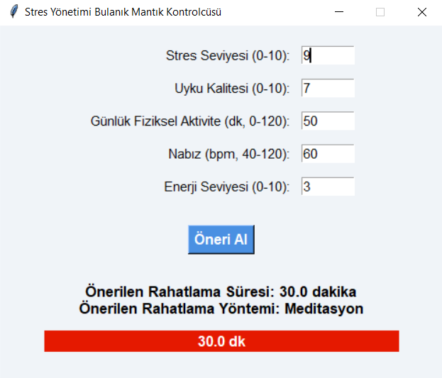

# StressCoach – Bulanık Mantık ile Akıllı Meditasyon Öneri Sistemi

**StressCoach**, kullanıcıdan alınan stres seviyesi, uyku kalitesi, aktivite düzeyi, ruh hâli ve günün saatine göre **en uygun meditasyon türünü ve süresini** öneren bir masaüstü uygulamasıdır.  
Sistem, **bulanık mantık (fuzzy logic)** temelli çalışır ve sezgisel bir kullanıcı arayüzüne sahiptir.

---


##  Özellikler

-  Bulanık mantık (fuzzy logic) ile karar sistemi
-  Tkinter tabanlı kullanıcı dostu arayüz
-  5 giriş:
  - Stres seviyesi (0–10)
  - Uyku kalitesi (1–10)
  - Aktivite düzeyi (dk)
  - Ruh hâli (yorgun, huzursuz, mutlu → sayısal değerle)
-  2 çıktı:
  - Meditasyon süresi (dakika)
  - Meditasyon türü (nefes, rahatlama, odaklanma, beden tarama)

---

##  Uygulamayı Çalıştırma

### 1. Python kurulumu

Python 3.8 veya üzeri bir sürüm sisteminizde yüklü olmalıdır.  
🔗 [Python İndir](https://www.python.org/downloads/)

### 2. Gerekli Kütüphaneleri Kur

Aşağıdaki komutları terminale veya Anaconda Prompt’a yazın:

```bash
pip install numpy
pip install scikit-fuzzy
pip install networkx
pip install scipy
```
### 3. Projeyi klonla
```bash
git clone https://github.com/AliZenginn/BulanikMantik.git
```
### Çalıştır
```bash
python StressCoach.py
```
